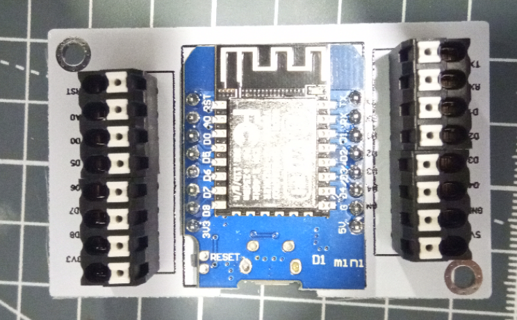

# Wemos D1 mini Adapter PCB
 Wemos D1 mini / ESP-12 Adapter auf Klemmen

## benötigte Hardware 

* 1x Wemos D1 mini / ESP-12 
* 4x Federkraftklemme 4-pol, Ø 1,5 mm, RM 3,5  (AST 04 3,5) oder 2x WAGO 2081-1128

Beim Verwenden eines ESP-12 werden zusätzlich folgende Teile benötigt
* 1x AMS1117-3,3
* 1x Kondensator 22µF 0805

[Kontakt via Facebook](https://www.facebook.com/ronny.thomas.83)

[Kontakt via Homematic Forum](https://homematic-forum.de/forum/memberlist.php?mode=viewprofile&u=13127)

